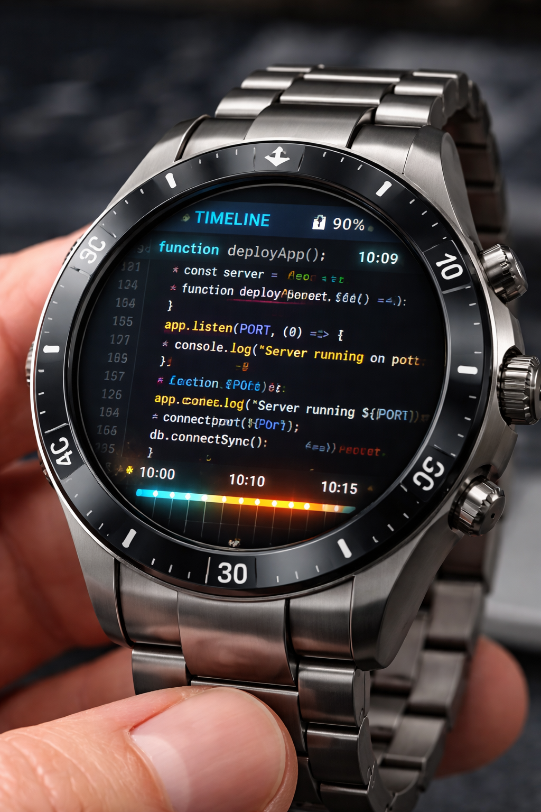

# EditorWatch

**Code authenticity monitor for programming assignments** - Track how students write code, not just what they write.

<p align="center">
  
</p>

## What It Does

EditorWatch helps educators detect AI-generated or copied code by monitoring the **coding process**:

- ✅ Tracks typing patterns, edits, and development timeline
- ✅ Detects paste bursts and suspicious patterns
- ✅ Provides visual timeline of student work
- ✅ Privacy-focused: students must explicitly consent

## Quick Start

### For Educators

1. **Deploy the server** (free on Railway):
   ```bash
   git clone https://github.com/Vic-Nas/EditorWatch
   # Deploy to Railway, Heroku, or run locally
   ```

2. **Create an assignment** via web dashboard:
   - Add student names and emails (or upload CSV)
   - Set deadline and file patterns to track
   - Students receive access codes via email

3. **Share the `editorwatch` file** with students

4. **Review submissions** with detailed analytics

### For Students

1. **Install extension** from VS Code Marketplace (search "EditorWatch")

2. **Place `editorwatch` file** in your assignment folder (root directory, no extension)

3. **Enter your access code** when prompted

4. **Code normally** - monitoring is automatic

5. **Submit** by clicking the 👁️ icon when done

## Key Features

### Smart Analytics
- **Incremental Score**: Gradual vs. sudden code appearance
- **Typing Variance**: Natural vs. robotic patterns
- **Error Correction**: Trial-and-error vs. perfect-first-time
- **Paste Detection**: Identifies large code blocks

### Easy Student Management
- Upload student lists (CSV with email, first name, last name)
- Reuse saved lists across assignments
- Automatic access code generation and emailing

### Privacy First
- Students explicitly opt-in for each assignment
- Only tracks specified file patterns (e.g., `*.py`)
- Data encrypted and deleted after grading
- Open source - verify what it does

## Installation

### Server Deployment

**Option 1: Railway (Recommended)**
```bash
# One-click deploy
# Add these environment variables:
DATABASE_URL=postgresql://...
REDIS_URL=redis://...
SECRET_KEY=your-secret-key
ADMIN_USERNAME=admin
ADMIN_PASSWORD=your-password
```

**Option 2: Local Development**
```bash
pip install -r requirements.txt
export DATABASE_URL='sqlite:///editorwatch.db'
python app.py
```

### VS Code Extension

Install from [VS Code Marketplace](https://marketplace.visualstudio.com/items?itemName=vn-tf.editorwatch) or:

```bash
cd extension
npm install
code --install-extension .
```

## How It Works

```
┌─────────────┐         ┌──────────────┐         ┌─────────────┐
│   Student   │────────▶│  VS Code Ext │────────▶│   Server    │
│  codes in   │  tracks │   monitors   │ submits │  analyzes   │
│  VS Code    │  edits  │   changes    │  events │  patterns   │
└─────────────┘         └──────────────┘         └─────────────┘
                                                           │
                                                           ▼
                                                   ┌──────────────┐
                                                   │  Dashboard   │
                                                   │  for teacher │
                                                   └──────────────┘
```

## Configuration

### Student List CSV Format
```csv
email,first_name,last_name
alice@uni.edu,Alice,Johnson
bob@uni.edu,Bob,Smith
```

### Assignment Config (`editorwatch` file)
```json
{
  "assignment_id": "CS101_HW3",
  "server": "https://your-server.railway.app",
  "track_patterns": ["*.py", "*.js"],
  "deadline": "2025-02-15T23:59:59Z",
  "course": "CS 101",
  "name": "Homework 3"
}
```

## Limitations

- **Not foolproof**: Determined students can bypass monitoring
- **Use as one tool**: Combine with code reviews, oral exams
- **Requires VS Code**: Students using other editors won't be tracked
- **Explicit consent**: Students must agree to monitoring

## License

**Dual License:**
- **Free** for non-profit education (MIT License)
- **Paid** for commercial use (bootcamps, EdTech companies)

See [LICENCE.md](LICENCE.md) for details.

## Support

- 📖 [Documentation](https://github.com/Vic-Nas/EditorWatch/wiki)
- 🐛 [Report Issues](https://github.com/Vic-Nas/EditorWatch/issues)
- 💬 [Discussions](https://github.com/Vic-Nas/EditorWatch/discussions)